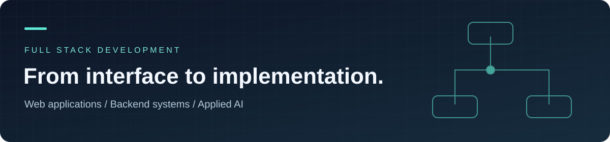

  

<h1 align="center">Ammar Yasser</h1>

<strong>Full Stack Developer · TypeScript, React, Next.js &amp; Node.js</strong> Building useful web applications, thoughtful APIs, and projects that connect software with AI.

  <a href="https://ammar-portfolio-red.vercel.app"><strong>Portfolio</strong></a> &nbsp; / &nbsp;
  <a href="https://www.linkedin.com/in/ammar-yasser2003"><strong>LinkedIn</strong></a> &nbsp; / &nbsp;
  <a href="mailto:ay109543@gmail.com"><strong>Email</strong></a> &nbsp; / &nbsp;
  <a href="https://github.com/AmmarYasser72/AmmarYasser72/raw/main/assets/cv/Ammar_Yasser_Abdallah_Full_Stack_Developer_CV.pdf"><strong>Full Stack CV</strong></a> &nbsp; / &nbsp;
  <a href="https://github.com/AmmarYasser72/AmmarYasser72/raw/main/assets/cv/Ammar_Yasser_Abdallah_AI_Engineer_CV.pdf"><strong>AI CV</strong></a>

---

## What I build

I'm a developer based in Alexandria, Egypt, with a 2026 Bachelor's Degree in Computers and Data Science from Alexandria University. I work across responsive interfaces, backend APIs, and applied AI, with professional experience in freelance development, technical instruction, full stack training, and AI automation.

- **Web applications:** React and Next.js interfaces with reusable components, dashboards, forms, and clear loading and error states.
- **Backend systems:** Node.js, Express, and NestJS APIs with authentication, resource ownership, validation, and MongoDB data models.
- **Applied AI:** Python projects spanning conversational assistants, computer vision, machine learning, and NLP experiments.

I care about understandable code, server-side authorization, reproducible setup, and documenting what a project actually does.

My two CVs provide role-specific detail: use the **[Full Stack CV](https://github.com/AmmarYasser72/AmmarYasser72/raw/main/assets/cv/Ammar_Yasser_Abdallah_Full_Stack_Developer_CV.pdf)** for web, backend, and SaaS roles, or the **[AI CV](https://github.com/AmmarYasser72/AmmarYasser72/raw/main/assets/cv/Ammar_Yasser_Abdallah_AI_Engineer_CV.pdf)** for machine learning, NLP, computer vision, and applied AI roles.

## Selected projects

Six starting points for exploring my work. Each links directly to the implementation and its documentation.

| Project | What to explore | Technologies |
| :--- | :--- | :--- |
| **[EventX, Event Management](https://github.com/AmmarYasser72/Event-Management-System)** | Event and ticket workflows, QR check-in, role-specific dashboards, and a documented backend with automated tests. [View demo](https://event-management-system-3xxa.vercel.app) | React · Express · MongoDB |
| **[E-Commerce Backend](https://github.com/AmmarYasser72/ECommerce-Backend-NEST)** | A modular API covering authentication, products, carts, wishlists, orders, and notifications. | NestJS · TypeScript · MongoDB |
| **[MindGuard Web](https://github.com/AmmarYasser72/MindGuard_NextJS)** | A graduation-project frontend with patient and clinician dashboards, wellness tracking, and chat interfaces. [View demo](https://mind-guard-next-js.vercel.app) | Next.js · TypeScript · Socket.IO |
| **[MindGuard AI](https://github.com/AmmarYasser72/MindGuard-Chatbot-and-AI_Models)** | A bilingual conversational assistant and wearable-signal models, with service architecture and evaluation documentation. Research prototype, not a clinical product. | Python · FastAPI · LangGraph |
| **[Exclusive Storefront](https://github.com/AmmarYasser72/Exclusive-E-Commerce)** | Product browsing, search, cart and wishlist interfaces, and reusable shopping components. [View demo](https://exclusive-e-commerce-sable.vercel.app) | Next.js · TypeScript · Tailwind CSS |
| **[VisionDeck](https://github.com/AmmarYasser72/visiondeck-cv-suite)** | A computer vision dashboard for face detection, hand gestures, and object detection, plus a YOLO fine-tuning assignment. | Python · Streamlit · Computer Vision |

**Want a focused code sample?** Start with the [Blog REST API](https://github.com/AmmarYasser72/Blog-REST-API-with-JWT-Auth) for JWT authentication and ownership checks, or the [classifier tuning experiment](https://github.com/AmmarYasser72/Tune-a-Classifier-to-Beat-a-Baseline) for cross-validation and model evaluation.

**[Browse the project directory →](PROJECTS.md)** &nbsp; · &nbsp; **[Explore my portfolio →](https://ammar-portfolio-red.vercel.app)**

## Technologies in my projects

| Area | Tools |
| :--- | :--- |
| Frontend | TypeScript, JavaScript, React, Next.js, HTML, CSS, Tailwind CSS, Vite |
| Backend & data | Node.js, NestJS, Express, MongoDB, Mongoose, REST APIs, Socket.IO |
| AI & experimentation | Python, FastAPI, Streamlit, Jupyter, scikit-learn, LangGraph, NLP, computer vision |
| Development workflow | Git, GitHub, Docker, Postman, Jest, pytest |

## Let's connect

For full stack development opportunities or collaboration on web and AI projects, reach me at **[ay109543@gmail.com](mailto:ay109543@gmail.com)** or connect on **[LinkedIn](https://www.linkedin.com/in/ammar-yasser2003)**.

Explore the source. Read the tradeoffs. Try the demos.

